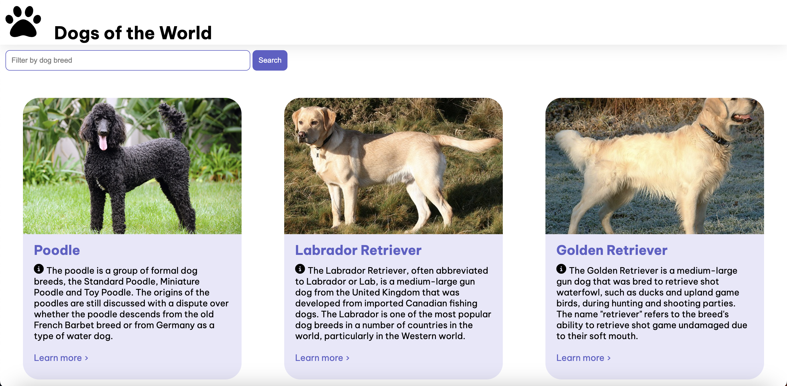

# dog-breeds-angular
An Angular App/site that displays information about different dog breeds for a technical test using Typrescript/Angular Framework

## Current look of the site:

## Objectives:

###  Create a site centered around information around different dog breeds

Key Steps: 
1. Set up IDE/Workspace in VSCode
2. Ensure all dependencies were installed with lastest stable versions
3. Read through the Angular documentation to walkthrough how to create an Angular App in VSCode

## Issues:

- I was not able to install the Angular CLI at first due to permissions issues and errors showing in the terminal. I found a helpful fix online for this, and by inputting this command I had access and full permissions granted to use the Angular CLI:
    - 
