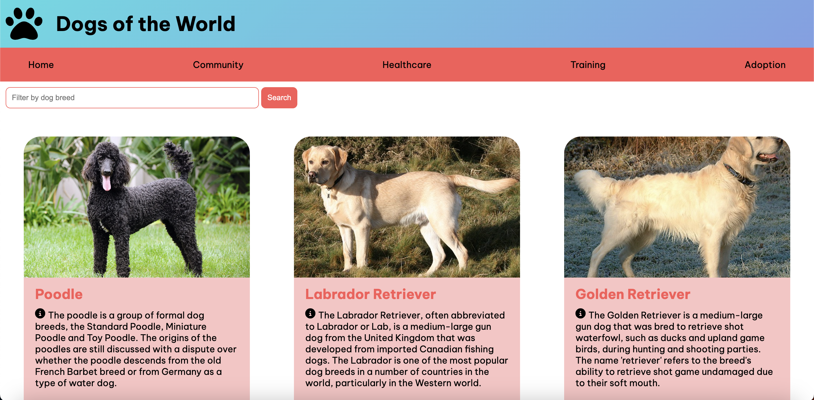

# dog-breeds-angular
An Angular App/site that displays information about different dog breeds for a technical test using Typrescript/Angular Framework.

I have continued to develop this project after the technical test in order to get a bit more familiar with Angular/Typescript, using the Angular docs alongside to help me.

## Early version of the site (static):

## Current look of the site with a JSON Server hosting the dog breeds

You can now filter by dog breed with this added functionality in the search bar. This was completed thanks to the Angular documentation:

There is a details page now up and running - it's basic for now, I will restyle and add more content in a future update:

## Objectives:

###  Create a site centered around information around different dog breeds

Key Steps: 
1. Set up IDE/Workspace in VSCode
2. Ensure all dependencies were installed with lastest stable versions
3. Read through the Angular documentation to walkthrough how to create an Angular App in VSCode

## Issues:

- I was not able to install the Angular CLI at first due to permissions issues and errors showing in the terminal. I found a helpful fix online for this, and by inputting this command I had access and full permissions granted to use the Angular CLI:
    - 

- Early on I struggled to get the details page up and running - however with a bit of persistence and some really useful suggestions from Github Co-pilot which I have just started using, I was able to get it working.
    - 

## Credits:

- The [Angular Docs](https://angular.io/docs) and [Tutorials](https://angular.io/tutorial/first-app) were used extensively to help me to use an unfamiliar framework for the first time!
- I also found the fix for the Angular CLI issue on stackoverflow - I will paste the link to the exact page soon.
- I started utilising a new coding companion tool after the assesment called Github Co-pilot. It actually helped me to resolve the details page issues I was having!
